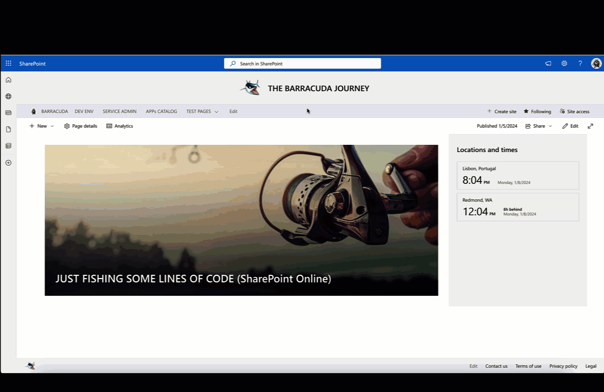

# SPFX WebPart providing an indicator to users by tagging the current Site Page 

## Summary

Imagine providing a Training Path to users by tagging a Site Page with a choice column indicating its relevant training. This WebPart suggests a way to implement the current active page, guided by a straightforward timeline.

## Used SharePoint Framework Version

## Applies to

- [SharePoint Framework](https://aka.ms/spfx)
- [Microsoft 365 tenant](https://docs.microsoft.com/en-us/sharepoint/dev/spfx/set-up-your-developer-tenant)

> Get your own free development tenant by subscribing to [Microsoft 365 developer program](http://aka.ms/o365devprogram)

## Solution

| Solution    | Author(s)                                               |
| ----------- | ------------------------------------------------------- |
| react-training-sample | Joao Livio @jlivio |

## Version history

| Version | Date             | Comments        |
| ------- | ---------------- | --------------- |
| 1.0     | January 8, 2024 | Initial release |

## Disclaimer

**THIS CODE IS PROVIDED _AS IS_ WITHOUT WARRANTY OF ANY KIND, EITHER EXPRESS OR IMPLIED, INCLUDING ANY IMPLIED WARRANTIES OF FITNESS FOR A PARTICULAR PURPOSE, MERCHANTABILITY, OR NON-INFRINGEMENT.**

---

## Minimal Path to Awesome

- Clone this repository
- Ensure that you are at the solution folder
- in the command-line run:
  - **npm install**
  - **gulp clean**
  - **gulp build serve**
- Use SPFx Fast Serve Tool
  - **npm run serve**
  
## Features

- Demo the active tagged page
- Demo Higligth the minimal timeline content
- Using PnPjs with React Functional Components & Hooks
- Extending the SharePoint Queryables instance with the PnPLogging behavior.
- Extending the SharePoint Queryable instance with the Caching behavior
- Loading list items from a SharePoint library

## References

- [PnPjs Library v3)](https://pnp.github.io/pnpjs/)
- [SPFx Fast Serve Tool)](https://github.com/s-KaiNet/spfx-fast-serve/)
- [React Hooks, Custom Hooks (PnPjs Repo Sample)](https://github.com/pnp/sp-dev-fx-webparts/tree/main/samples/react-pnp-js-hooks/)

Help
----

We do not support samples, but this community is always willing to help, and we want to improve these samples. We use GitHub to track issues, which makes it easy for community members to volunteer their time and help resolve issues.

If you're having issues building the solution, please run [spfx doctor](https://pnp.github.io/cli-microsoft365/cmd/spfx/spfx-doctor/) from within the solution folder to diagnose incompatibility issues with your environment.

You can try looking at [issues related to this sample](https://github.com/pnp/sp-dev-fx-webparts/issues?q=label%3A%22sample%3A%20react-pnp-js-hooks%22) to see if anybody else is having the same issues.

You can also try looking at [discussions related to this sample](https://github.com/pnp/sp-dev-fx-webparts/discussions?discussions_q=react-pnp-js-hooks) and see what the community is saying.

If you encounter any issues using this sample, [create a new issue](https://github.com/pnp/sp-dev-fx-webparts/issues/new?assignees=&labels=Needs%3A+Triage+%3Amag%3A%2Ctype%3Abug-suspected%2Csample%3A%20react-pnp-js-hooks&template=bug-report.yml&sample=react-pnp-js-hooks&authors=@bcameron1231&title=react-pnp-js-hooks%20-%20).

For questions regarding this sample, [create a new question](https://github.com/pnp/sp-dev-fx-webparts/issues/new?assignees=&labels=Needs%3A+Triage+%3Amag%3A%2Ctype%3Aquestion%2Csample%3A%20react-pnp-js-hooks&template=question.yml&sample=react-pnp-js-hooks&authors=@bcameron1231&title=react-pnp-js-hooks%20-%20).

Finally, if you have an idea for improvement, [make a suggestion](https://github.com/pnp/sp-dev-fx-webparts/issues/new?assignees=&labels=Needs%3A+Triage+%3Amag%3A%2Ctype%3Aenhancement%2Csample%3A%20react-pnp-js-hooks&template=suggestion.yml&sample=react-pnp-js-hooks&authors=@bcameron1231&title=react-pnp-js-hooks%20-%20).

---------------------------------------------------------------------------------------------

Disclaimer
----------

**THIS CODE IS PROVIDED *AS IS* WITHOUT WARRANTY OF ANY KIND, EITHER EXPRESS OR IMPLIED, INCLUDING ANY IMPLIED WARRANTIES OF FITNESS FOR A PARTICULAR PURPOSE, MERCHANTABILITY, OR NON-INFRINGEMENT.**